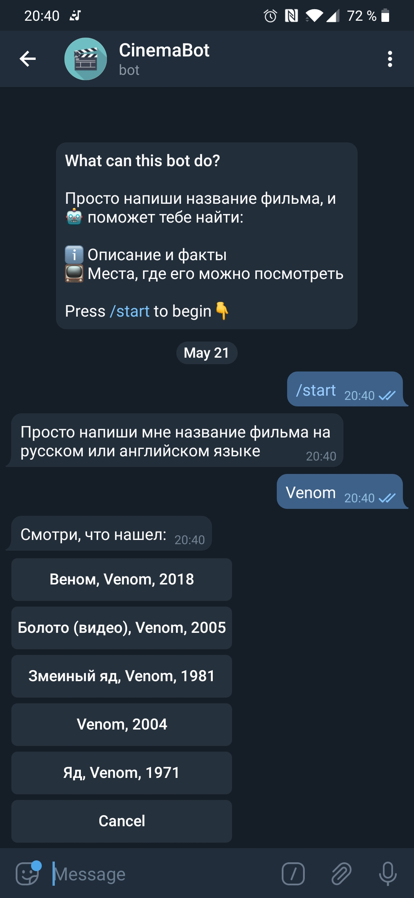
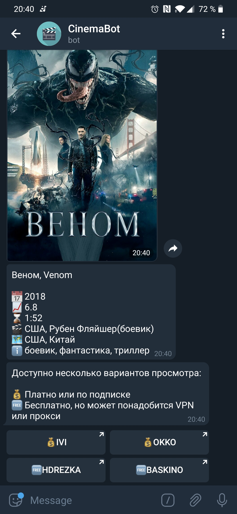
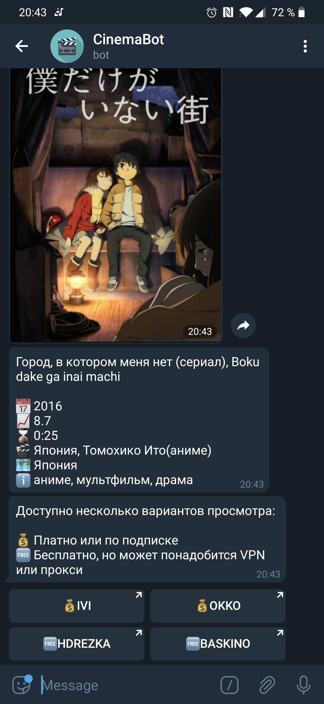

# Cinema Bot ([@cinema_rvg_bot](https://t.me/cinema_rvg_bot))

Cinema Bot is a python Telegram bot, which can help you to find:
* Info about movie
* Places to watch a movie

## Built with

* `aiogram`
* `aiohttp`
* [`kinopoisk unofficial api`](http://kinopoiskapiunofficial.tech/user)
* [ivi](ivi.ru), [okko](okko.tv), [baskino](baskino.me), [hdrezka](http://ikinopoisk.com/) search engines

Given the name of movie, bot makes the request to the `kinopoisk unofficial api`, parses `JSON` with description and poster `url` and gives a user a chance to choose the particular film(by maintaining current session state).

After that, it redirects to online cinema search engines pages.

## Usage
The only thing you need to do is to type the name of movie or TV series:

|  	|  	|  	|  	|  	|
|----------------------------	|----------------------------	|----------------------------	|----------------------------	|----------------------------	|

## Contributing
Pull requests are welcome. For major changes, please open an issue first to discuss what you would like to change.

Please make sure to update tests as appropriate.

## License
[MIT](https://choosealicense.com/licenses/mit/)
